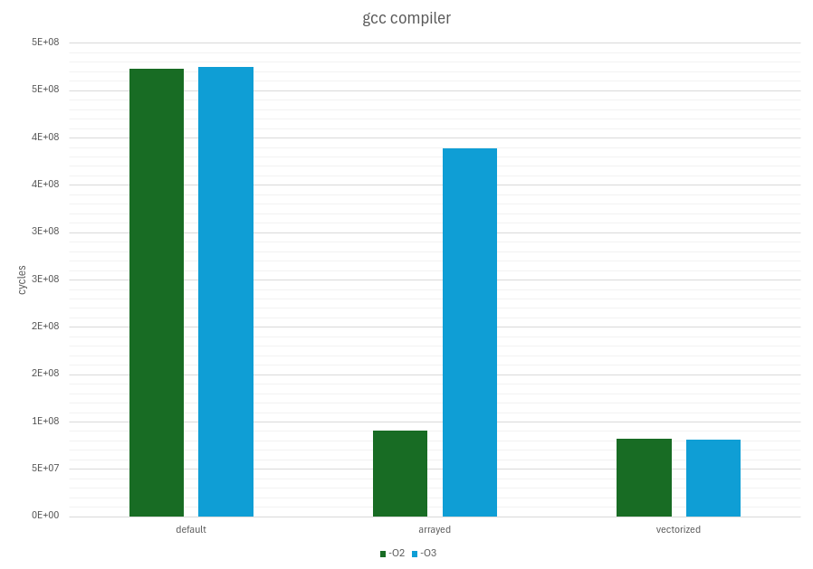
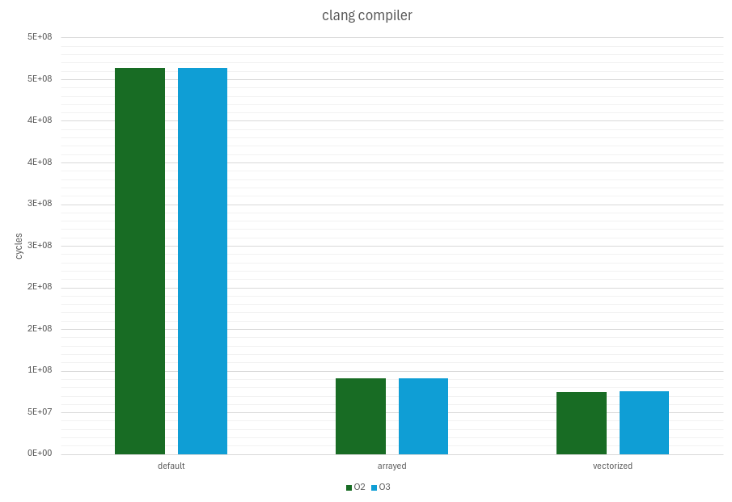

# The Mandelbrot Set


## Description
The program for visualizing the Mandelbrot set is written in C and C++.
The aim of the project is to compare different algorithms for calculating the Mandelbrot set with performance analysis.

## Features
- implementation of several algorithms (naive, array-based, SIMD-based);
- visualization with the ability to zoom and move the image;
- conditional compilation for testing the program.

## Build and launch
```bash
git clone https://github.com/lavrt/MandelbrotSet.git
cd MandelbrotSet
make run 
```

##### Description of compilation flags
- `CXX=COMPILER` - compiler selection (gcc, clang, default is gcc).
- `RENDER_MODE=MODE` - rendering algorithm selection (DEFAULT_RENDER, ARRAYED_RENDER, VECTORIZED_RENDER, default is DEFAULT_RENDER).
- `OPT=LEVEL` - optimization level (-O0, -O1, -O2, O3, default is -O0).
- `TEST=1` - enables a mode for testing the program with further information dumping to a file 'tests/tests.txt' without visualization (default is 0).

## Implemented algorithms
| Algorithm | Description |
| --------- | ----------- |
| naive (default render)    | basic algorithm |
| arrayed-based (arrayed render) | algorithm with vectorization using arrays |
| SIMD-based (vectorized render) | algorithm with vectorization using intrinsics |

## Performance comparison
### Settings
- image size: 1920*1080;
- maximum iterations: 300;
- CPU: 12th Gen Intel Core i5-12450H × 12.

### Results
#### gcc compiler:
| Algorithm     | Cycles (-O2)| Cycles (-O3)|
| ---------     |-----        | -----       | 
| naive         | (4.73 ± 0.39)e8, <u>(x1.0) | (4.74 ± 0.40)e8, <u>(x1.0) |
| arrayed-based | (9.03 ± 0.20)e7, <u>(x5.2) | (3.89 ± 0.95)e8, <u>(x1.2) |
| SIMD-based    | (8.15 ± 0.28)e7, <u>(x5.8) | (8.14 ± 0.19)e7, <u>(x5.8) |



#### clang compiler:
| Algorithm     | Cycles (-O2)| Cycles (-O3)|
| ---------     |-----        | -----       |
| naive         | (4.63 ± 0.27)e8, <u>(x1.0) | (4.64 ± 0.28)e8, <u>(x1.0) 
| arrayed-based | (9.13 ± 0.05)e7, <u>(x5.1) | (9.13 ± 0.14)e7, <u>(x5.1) 
| SIMD-based    | (7.47 ± 0.13)e7, <u>(x6.2) | (7.51 ± 0.10)e7, <u>(x6.2) 




