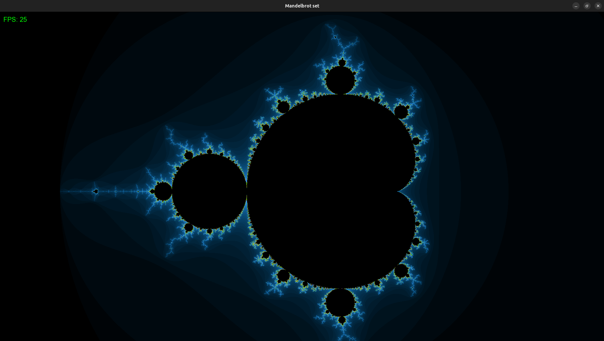

# The Mandelbrot Set



## Description
A program for visualizing the Mandelbrot set using:
- C++
- SFML for graphics
- SIMD optimization (AVX)

## Features
- Optimized rendering

## Build and launch
```bash
make && make run
```