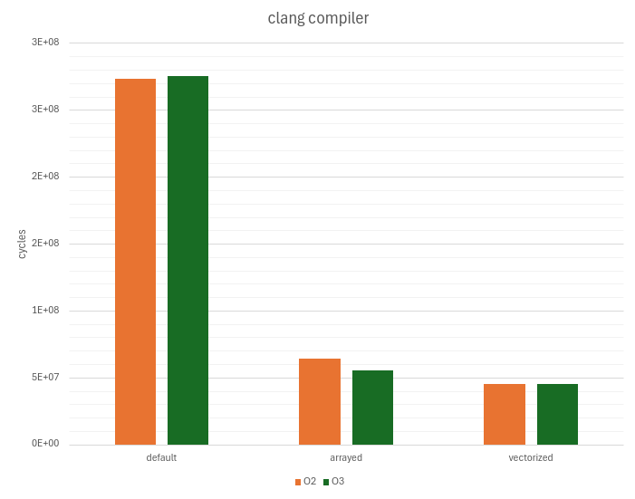

# The Mandelbrot Set


## Description
The program for visualizing the Mandelbrot set is written in C and C++.
The aim of the project is to compare different algorithms for calculating the Mandelbrot set with performance analysis.

## Features
- implementation of several algorithms (naive, array-based, SIMD-based);
- visualization with the ability to zoom and move the image;
- conditional compilation for testing the program.

## Build and launch
```bash
git clone https://github.com/lavrt/MandelbrotSet.git
cd MandelbrotSet
make run 
```

##### Description of compilation flags
- `CXX=COMPILER` - compiler selection (gcc, clang, default is gcc).
- `RENDER_MODE=MODE` - rendering algorithm selection (DEFAULT_RENDER, ARRAYED_RENDER, VECTORIZED_RENDER, default is DEFAULT_RENDER).
- `OPT=LEVEL` - optimization level (-O0, -O1, -O2, O3, default is -O0).
- `TEST=1` - enables a mode for testing the program with further information dumping to a file 'tests/tests.txt' without visualization (default is 0).

## Implemented algorithms
| Algorithm | Description |
| --------- | ----------- |
| naive (default render)    | basic algorithm |
| arrayed-based (arrayed render) | algorithm with vectorization using arrays |
| SIMD-based (vectorized render) | algorithm with vectorization using intrinsics |

## Performance comparison
### Settings
|                         |                                    |
|-------------------------|------------------------------------|
| Image size              | 1920*1080                          |
| Maximum iterations      | 300                                |
| CPU                     | 12th Gen Intel Core i5-12450H × 12 |
| Average CPU frequency   | 2.0 GHz                            |
| Average CPU temperature | 72°C                               |
| The operating system    | Ubuntu 24.04.2 LTS                 |
| Kernel Version          | Linux 6.11.0-21-generic            |
| gcc compiler version    | 13.3.0                             |
| clang compiler version  | 18.1.3                             |


### Results
#### gcc compiler:
| Algorithm     | Cycles (-O0), e7  | Cycles (-O2), e7     | Cycles (-O3), e7     |
| ---------     |-----              |-----                 | -----                | 
| naive         | 57.10 ± 0.42      | 27.84 ± 0.71, (x1.0) | 27.82 ± 0.76, (x1.0) |
| arrayed-based |                   | 5.37 ± 0.03, (x5.2)  | 25.99 ± 0.12, (x1.1) |
| SIMD-based    |                   | 3.97 ± 0.03, (x7.0)  | 3.96 ± 0.03, (x7.0)  |


#### clang compiler:
| Algorithm     | Cycles (-O0), e7  | Cycles (-O2), e7     | Cycles (-O3), e7     |
| ---------     |-----              |-----                 | -----                | 
| naive         | 58.49 ± 0.56      | 27.36 ± 0.07, (x1.0) | 27.51 ± 0.61, (x1.0) |
| arrayed-based |                   | 6.38 ± 0.11, (x4.3)  | 5.51 ± 0.02, (x5.0)  |
| SIMD-based    |                   | 4.49 ± 0.03, (x6.1)  | 4.49 ± 0.02, (x6.1)  |




